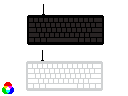
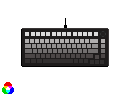

# MIDI-Typist Keyboard Firmware

Open-Source Portable C11 firmware that turns analog keyboards into NKRO keyboards + velocity-sensitive USB-MIDI controllers.

[](https://github.com/AL-255/MIDI-Typist/releases)
[](https://github.com/AL-255/MIDI-Typist/actions/workflows/docs.yml)
[](https://al-255.github.io/MIDI-Typist/)

| Model | Status | Analog? | Features |
| ---  | --- | --- | --- |
| [](USER_MANUAL.md) | Stable | ✅ Optical | NKRO; Per-Key RGB |
| [](docs/MONSGEEK_M1.md) | Experimental | ✅ TMR | NKRO; Per-Key RGB; Tri-Mode (USB, Bluetooth, 2.4 GHz) |

Each model has its own firmware image. The SDK-free 104-key simulator is a
development port, not a supported physical keyboard.

[Documentation website](https://al-255.github.io/MIDI-Typist/) ·
[User manual](USER_MANUAL.md) · [Build guide](docs/BUILDING.md) ·
[Porting guide](docs/PORTING.md)

The Huntsman port uses official NXP MCUXpresso USB/peripheral drivers and
retains its bootloader and computer-initiated updater. Other hardware needs a
board port, not the Huntsman binary.

The [MonsGeek M1 V5 TMR backend](docs/MONSGEEK_M1.md) provides official-SDK
scan/lighting/radio/battery/power HAL components, an 82-key application library, offline-tested
transport/power policies, an experimental application image and a matching GUI preview.
Application flashing, recovery and live 82-key USB telemetry are hardware-checked.
Startup uses provisional travel bounds when factory records cannot be imported.
Released-key acquisition is hardware-checked at 8 kHz with GUI telemetry active.
Pressed-key performance and complete wireless/power behavior remain unverified;
this is not a daily-use port.
See the [M1 update and recovery limits](docs/DEVICE_FLASHING.md#monsgeek-m1-experimental-conversion).
Each hardware backend builds separately—not one universal binary.

## Use the keyboard

- NKRO typing, right-side arrows and a green-hinted Fn shortcut layer.
- Fn+Enter switches keyboard/MIDI mode; settings preview while held and act
  on release. Release all keys afterward.
- MIDI notes, per-key velocity, polyphonic aftertouch, pitch/modulation wheels
  and sustain on channel 1. Choose piano or Jankó layout, root/scale and octave.
- Per-key Schmitt thresholds default to **3500 press / 3600 release**;
  lower readback means a deeper press.
- Fn+C calibrates keys in parallel. Fn+Tab adjusts triggers; Fn+K/L changes
  brightness. Fn+R requires Y confirmation before clearing custom settings.
- Committed settings and calibration persist on-device. Release all keys and
  wait for **settings saved** in the GUI before unplugging; saving waits for
  250 ms without changes. Missing/corrupt saves initialize defaults.

See the [illustrated manual](USER_MANUAL.md) for the complete shortcuts,
[note maps](USER_MANUAL.md#default-notes-two-overlapping-playing-ranges),
lighting and menu instructions.

## Configuration GUI

On Linux with Python 3.10+ and Tk:

```sh
python3 -m venv build-gui-venv
build-gui-venv/bin/pip install -r tools/requirements-gui.txt
build-gui-venv/bin/python tools/keyboard_gui.py          # auto-detect the MIDI SysEx device
build-gui-venv/bin/python tools/keyboard_gui.py --demo   # preview without hardware
```

The board-aware GUI edits thresholds/mappings, displays velocities, starts calibration,
exports host JSON profiles and flashes application images after confirmation.
It provides per-key keyboard keycode dropdowns with on-device persistence.
Fn combinations remain fixed; platform defaults live in each board's
`config/keymap.def`.
Use the performance MIDI port in your DAW and the separate control port in the GUI.
Only one GUI session may own control. See [GUI operation](docs/KEYBOARD_GUI.md).
Preview the M1's 75% layout without hardware with `--demo --board MG-M1V5TMR`.

## Build from scratch

Install CMake 3.21+, Ninja, a native C compiler, Python 3.10+ and Arm GNU
bare-metal tools. The pinned official NXP source subset is included; neither
the original updater EXE nor extracted firmware is needed to build.

```sh
git clone https://github.com/AL-255/MIDI-Typist.git
cd MIDI-Typist
cmake --preset host-tests
cmake --build --preset host-tests
ctest --preset host-tests
cmake --preset huntsman
cmake --build --preset huntsman
```

Output: `build-huntsman/huntsman_firmware.bin`, exactly 131072 bytes.
This checkout supports only the current custom firmware and matching GUI.
Superseded code, firmware variants and compatibility fallbacks are removed;
the rule is defined in [AGENTS.md](AGENTS.md#latest-implementation-only).
Use `simulator` for the SDK-free desktop port.
[Build prerequisites and tests](docs/BUILDING.md) ·
[Validation scope](docs/VALIDATION.md)

## Flashing and safety

Use the [custom firmware flashing tool](https://github.com/AL-255/Huntsman-V3-Pro-Mini-Flasher)
through the GUI's **Device flashing** tab. It identifies application/bootloader
state and offers install, custom reflash, or restoration from a user-supplied
Razer application. See the [flashing guide](docs/DEVICE_FLASHING.md).
Initialize its updater backend:

```sh
git submodule update --init third_party/huntsman_updater
```

Choose **application only**, leaving secondary firmware disabled. Normal
updates preserve compatible saves. Fn+R explicitly deletes custom settings and calibration.
The GUI is the project's only desktop application; the linked updater remains its backend. Builds, tests and documentation CI never flash.

Custom storage writes only **0x78000 and 0x78200**. Razer primary settings and
serial data, bootloader, factory/security data and the optical ASIC firmware
are not write targets. Returning to stock may reclaim the custom tail space.
Keep device dumps private. See [storage boundaries](docs/DEVICE_CONFIG_STORAGE.md).

## Development and documentation

Start with [architecture](docs/ARCHITECTURE.md), then the
[board-porting guide](docs/PORTING.md). Shared algorithms remain independent of
the MCU SDK; each board owns acquisition, USB, lighting and safe storage.

The [documentation guide](docs/README.md) links all technical references.
[Sphinx build and publishing](docs/DOCUMENTATION.md) explains local previews,
strict link checks and GitHub Pages CI. The same Markdown is readable on GitHub.

Project code is [GPL-2.0](LICENSE); vendor files retain their upstream
[licenses and provenance](third_party/ORIGINS.md).
